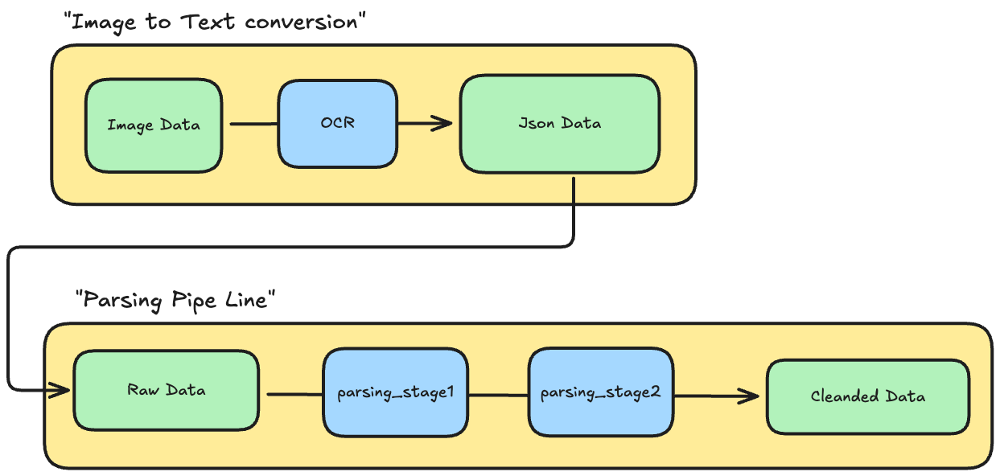

# OCR Parsing Project

계근지/영수증 OCR JSON에서 업무 필드를 추출해 `JSON`/`CSV`로 저장하는 규칙 기반 파서입니다.  
핵심 목표는 다음 2가지입니다.

- OCR 노이즈(띄어쓰기 깨짐, 라벨 누락, 값 포맷 흔들림) 상황에서도 보수적으로 파싱
- 결과를 고정 스키마로 출력해 후속 저장/분석 파이프라인에서 재사용 가능하게 유지

## Quick Start (OS별 재현 가이드)
Quick Start 전체는 `QUICKSTART.md`에서 확인하세요: [바로가기](QUICKSTART.md)

## 아키텍처


## 문제 분석과 설계 의도
OCR 원문(계근지/영수증)은 아래와 같은 노이즈가 반복적으로 나타납니다.

- 라벨 깨짐: `거 래 처`, `총 중 량`, `일 시`처럼 공백/분절이 섞임
- 값 포맷 흔들림: `02 : 13`, `11시 33분`, `13 460 kg`처럼 표기 일관성이 낮음
- 라벨 누락/위치 이동: 값만 단독 라인에 나오거나, 라벨과 값이 다음 줄로 분리됨
- OCR 누락/오인식: 회사명, 거래처, 숫자 일부가 빠지거나 잘못 인식됨

이 상황에서 한 번에 공격적으로 추론하면 오탐을 정답처럼 저장할 위험이 큽니다.  
그래서 이 프로젝트는 **정확도 우선(보수적 파싱)** 원칙으로, 파이프라인을 2단계로 분리했습니다.

- Stage1(Strict): 라벨+값 계약을 만족하는 것만 채택
- Stage2(Recovery): Stage1에서 빈 필드만 제한적으로 보강

즉, **먼저 확실한 값만 확보하고, 그 다음에만 신중하게 복구**하는 구조입니다.

## 현재 디렉터리 구조
```text
src/ocr-parser/
  cli.py                    # CLI 진입점, 인자 파싱 후 전체 파이프라인 실행
  collect/
    file_collector.py       # 입력 경로에서 JSON 파일 목록 수집
  input/
    load_json.py            # OCR JSON 로드 및 pages[0].lines[].text 추출
  services/
    pipeline_service.py     # 파일 1건 단위 파싱/출력 전체 흐름 조합
  parsing/
    common/
      normalize.py          # 공백/문자열 정규화 유틸
      parsing_labels.py     # 라벨 키워드/스키마 필드 정의
      parsing_validators.py # 날짜/시간/중량 등 값 검증기
      parsing_company.py    # 업체명/거래처명 파싱 보조 로직
      patterns.py           # 공통 정규식 패턴 모음
    stage1/
      orchestrator.py       # Stage1 엄격 파싱 오케스트레이션
      rules.py              # 라벨+값 기반 Stage1 규칙 집합
    stage2/
      orchestrator.py       # Stage2 복구 파싱 오케스트레이션
      recovery_common.py    # Stage2 공통 복구 유틸/헬퍼
      recovery_weight.py    # 중량/시간 관련 필드 복구
      recovery_identity.py  # 차량번호/계량횟수 등 식별 필드 복구
      recovery_geo.py       # 주소/좌표 관련 필드 복구
      recovery_issuer.py    # 발행자(업체) 정보 필드 복구
  out/
    result_writer.py        # 결과 JSON/CSV 경로 생성 및 파일 저장
  presentation/
    console_printer.py      # 콘솔 리포트 출력 포맷팅
```

## 의존성 / 실행 환경
- Python: `>=3.9` (타입 힌트 문법 기준)
- 로컬 확인 버전:
  - `Python 3.9.6`
  - `pip 26.0.1`
  - `setuptools 69.5.1`
  - `wheel 0.46.3`
- 외부 패키지 의존성: 없음 (`argparse`, `json`, `csv`, `re`, `pathlib` 등 표준 라이브러리만 사용)
- 주의: Python 3.9 환경에서는 `setuptools>=70`에서 `distutils` 관련 이슈가 발생할 수 있어
  `setuptools<70` 유지 권장

## 입력 데이터 계약
현재 로더는 OCR JSON에서 다음 경로만 사용합니다.

- `pages[0].lines[].text`

즉, **첫 페이지(`pages[0]`)만 파싱**합니다.

### 왜 첫 페이지만 파싱하나?
- 현재 샘플(01~04)이 모두 `numBilledPages: 1`인 단일 페이지 문서입니다.
- 샘플 데이터 계근지/영수증 형식이 모두 1장이라, 먼저 1페이지 기준으로 안정적인 규칙을 만드는 것이 우선이라고 판단했습니다.
- 범위를 넓히기 전에 1페이지 품질(정확도/오탐률)을 먼저 고정하는 전략입니다.

Trade-off:
- 다페이지 문서가 들어오면 2페이지 이후 정보는 현재 누락됩니다.
- 향후 멀티페이지 옵션을 추가하면 확장 가능합니다.

### boundingBox(좌표) 기반 파싱은 왜 아직 미적용인가?
좌표(`words[].boundingBox`)를 활용하면 분명히 더 정밀한 유추가 가능합니다.
- 장점: 표/열 구조 인식, 라벨-값의 공간적 연결, 헤더/본문/푸터 구분 개선
- 단점: 좌표 정규화, 읽기 순서 재구성, 다양한 스캔 품질/해상도 대응 로직이 필요해 구현 복잡도가 크게 증가

현재는 **학습/구현 시간 대비 안정성**을 고려해 텍스트 라인 기반 파서를 먼저 완성했습니다.  
즉, 좌표 기반은 "불가능"이 아니라 다음 단계 고도화 항목으로 남겨둔 상태입니다.

### OCR JSON의 `text` 필드를 왜 바로 쓰지 않았나?
샘플에는 `pages[0].text`와 최상위 `text`도 존재하며, 내용은 대체로 `lines[].text`의 합본과 유사합니다.  
그럼에도 `lines[].text`를 우선 사용한 이유는 다음과 같습니다.

- Stage1은 같은 줄의 `라벨+값` 검증이 핵심이라, 라인 단위 입력이 가장 자연스럽습니다.
- Stage2는 "근처 줄(±N줄)" 기반 복구를 수행하므로 line index가 필수입니다.
- 합본 `text`는 후처리 과정에서 줄 경계/공백이 변형될 수 있어 규칙 기반 파싱 안정성이 떨어질 수 있습니다.

정리하면, 현재 파서는 **라인 경계 보존과 규칙 안정성**을 위해 `lines[].text`를 기준 데이터로 선택했습니다.

## 출력 스키마
출력 스키마는 `parsing/common/parsing_labels.py`의 `PARSE_SCHEMA_FIELDS`를 기준으로 고정됩니다.

- `measured_date`
- `vehicle_no`
- `issuer_name`
- `customer_name`
- `item_name`
- `io_type`
- `ticket_id`
- `measure_count`
- `issuer_address`
- `issuer_tel`
- `issuer_fax`
- `gross_kg`
- `gross_time`
- `tare_kg`
- `tare_time`
- `net_kg`
- `net_time`
- `gps_lat`
- `gps_lon`
- `warnings` (문자열 리스트)

`CSV`는 `field, stage1_value, stage2_value` 3열로 저장됩니다.

## 파싱 설계
### 1) Stage 1 (Strict)
`parsing/stage1`에서 동작합니다.

- 같은 줄에서 `라벨 + 값` 형태만 허용
- 라벨 정규식(`parsing/common/parsing_labels.py`) 매칭 실패 시 버림
- 값 검증기(`parsing/common/parsing_validators.py`) 실패 시 버림
- 성공한 값만 스키마에 채움

특징:
- 보수적 파싱이 목적이라, 애매한 값은 빈값으로 남김
- 이미 채워진 필드는 덮어쓰지 않음

### 2) Stage 2 (Recovery)
`parsing/stage2`에서 동작합니다.

- Stage1에서 빈 필드만 복구
- 중량/시간, 입출고, ID/계량횟수, 거래처, GPS, 회사명 역할, issuer 연락처/주소를 단계적으로 보강
- 회사명은 `issuer`/`counterparty(customer_name)` 역할 점수화로 추론
- 복구 근거 및 모호성은 `warnings` 리스트에 키 형태로 기록

핵심 원칙:
- Stage1 성공값은 유지
- Stage2는 “가능성 높은 보강”만 수행
- 과감한 추론보다 오탐 방지를 우선

## 주요 가정 (Design Assumptions)
- OCR JSON은 `pages[0].lines[].text` 구조를 가진다.
- 계근지는 한국어 라벨/문구 중심이며, 현재 패턴은 한국 문서에 맞춰 설계됨
- 라벨 기반 추출이 우선, 추론/복구는 후순위
- `ticket_id`와 `measure_count`는 분리
  - `ticket_id`: 주로 `ID-NO` 계열
  - `measure_count`: `계량횟수`
- 전화번호는 하이픈 표준화해서 저장 (`0313599127` → `031-359-9127`)
- 좌표는 기본적으로 `위도, 경도` 순서를 가정하되 범위 힌트로 보정

## 한계
- 멀티페이지 OCR 미지원 (`pages[0]`만 처리)
- 규칙 기반 특성상 샘플과 다른 문서 레이아웃에서 누락/오탐 가능
- 문서 언어/도메인 확장(영문 양식, 타 업종 전표)에 취약
- `warnings`가 문자열 키 리스트라 기계적 분석(코드/메타)에는 불편할 수 있음
- 자동 테스트(예: golden set 비교)와 평가 리포트가 아직 없음

## 개선 아이디어
- `warnings`를 구조화 객체로 확장
  - 예: `{code, field, rule_id, message, line_idx}`
- 샘플 확장 + 회귀 테스트 추가 (`pytest` + expected json snapshot)
- 멀티페이지 파싱 옵션 추가 (`--page all` 등)
- 라벨/패턴을 코드 하드코딩 대신 설정 파일(YAML/JSON)로 외부화
- 회사명/주소/연락처 추론 점수에 신뢰도(score) 출력 추가
- CLI 옵션 확장
  - `--no-print`, `--only-stage2`, `--output-dir` 등

## 빠른 디버깅 팁
- 파일 수집 확인: `-v` 옵션 사용
- 규칙 미매칭 확인: 콘솔의 `[파싱-1단계]`에서 빈값 필드 확인
- 복구 확인: `[파싱-2단계]`의 `[2단계 보강]` 태그와 `warnings` 확인
